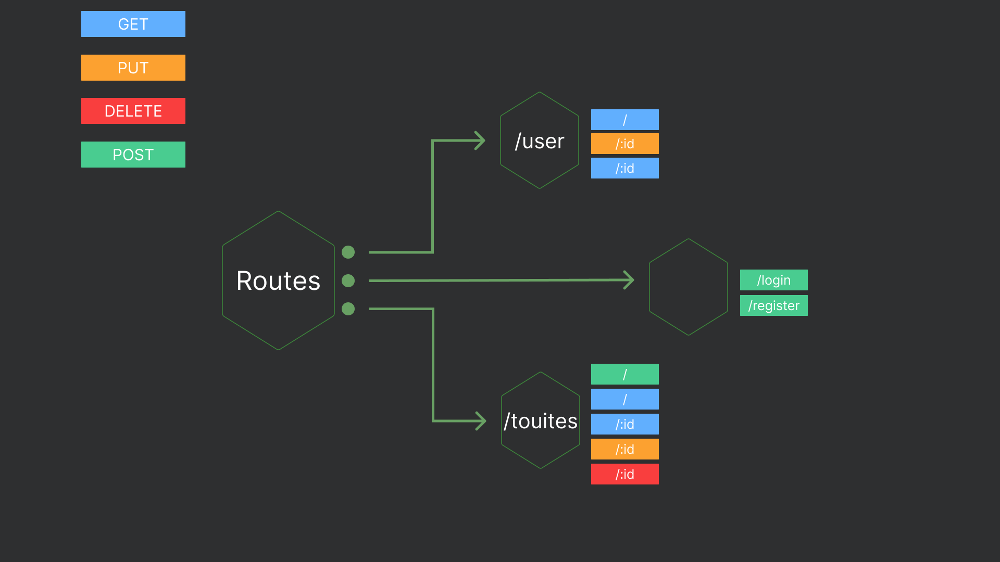

# TouiteurBack

Table of contents

<ol>
  <li><a href="#about-the-project" alt="About the project">about-the-project</a></li>
  <li><a href="#routes" alt="About the project">Routes</a></li>
  <li><a href="#built-with" alt="Built With" >built-with</a></li>
  <li><a href="#authors" alt="Authors" >authors</a></li>
  <li><a href="#license" alt="License" >license</a></li>
  <li><a href="#contact" alt="Contact" >contact</a></li>
</ol>

## About the project

The goal of this project is to create a Node.js server in TypeScript capable of managing the following functionalities: posting, reading, and deleting tweets, registering and authenticating users, as well as managing their profiles. The server should be able to store data in a database and ensure the security of transactions through encryption and authentication protocols. Unit and integration tests should be put in place to ensure the quality of the produced code.

## Routes

## Folder Structure
